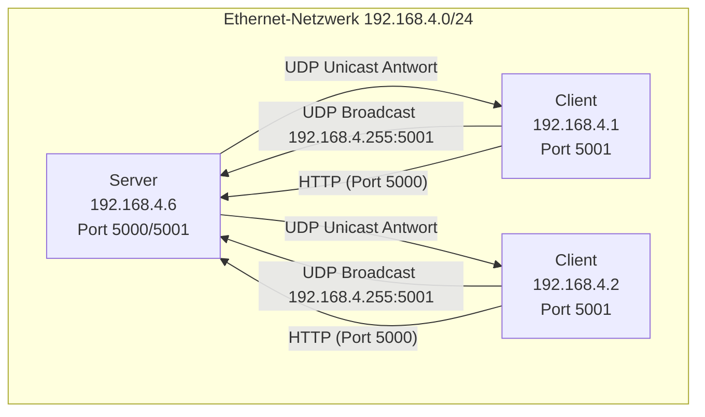

# Netzwerk-Discovery und Kommunikation (STM Cast)

## Übersicht

Das System besteht aus einem Server (z.B. Laptop, IP: 192.168.4.6) und einem oder mehreren Clients (z.B. Raspberry Pi, IP: 192.168.4.1). Die Kommunikation erfolgt in zwei Stufen:

---

## 1. UDP Discovery (Port 5001)

- **Client** sendet einen UDP-Broadcast an das Subnetz (z.B. 192.168.4.255:5001):
  ```json
  {"action": "discover", "service": "stedgeai-api"}
  ```
- **Server** lauscht auf Port 5001 und antwortet per UDP-Unicast an den Client:
  ```json
  {"service": "stedgeai-api", "ip": "192.168.4.6", "port": 5000}
  ```

**Ziel:** Der Client erfährt die IP und Port des Servers im Netzwerk.

---

## 2. HTTP REST API (Port 5000)

- Nach Discovery kommuniziert der Client per HTTP (z.B. FastAPI) mit dem Server:
  - `/` (GET): Health-Check
  - `/upload` (POST): Modell hochladen
  - `/generate` (POST): Modell kompilieren
  - `/outputs/{job_id}` (GET): Ergebnisse abfragen
  - `/download/{job_id}/{filename}` (GET): Datei herunterladen

---

## Beispiel-Netzwerk (Dummy-Graphik)



---

## Hinweise
- Der Server muss auf allen Interfaces (`0.0.0.0`) lauschen.
- Der Client muss Broadcast an die Subnetz-Broadcast-Adresse schicken (z.B. 192.168.4.255).
- Firewalls können UDP blockieren!
- Die Server-Antwort muss die echte IP enthalten, nicht 127.0.0.1.

---

**Tipp:**
- Teste UDP Discovery mit Tools wie `ncat`, `socat` oder PowerShell UDP-Client.
- Prüfe mit `netstat -an` ob Ports offen sind.
