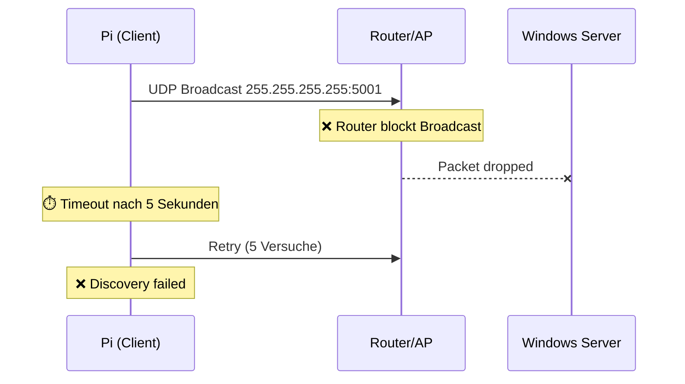
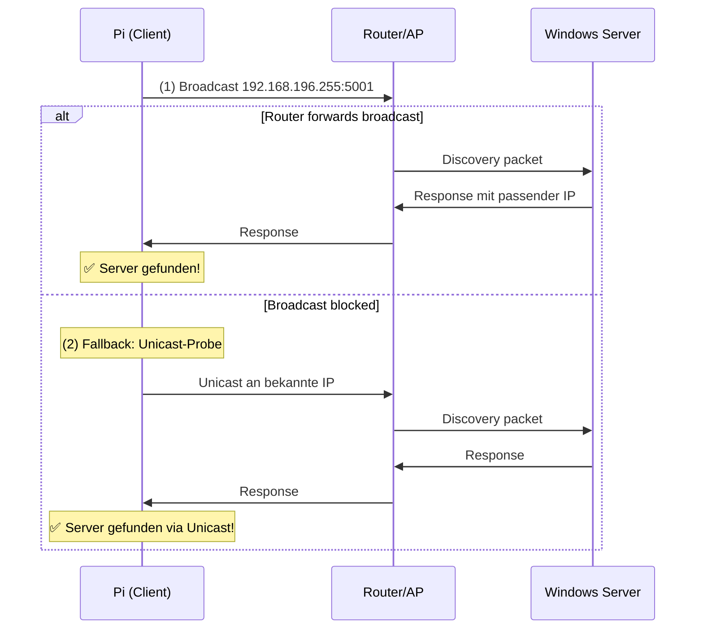
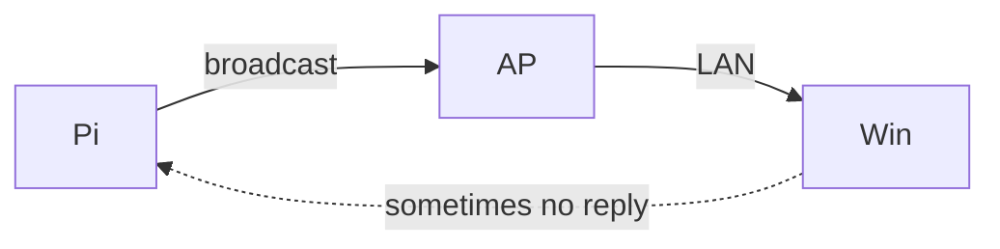
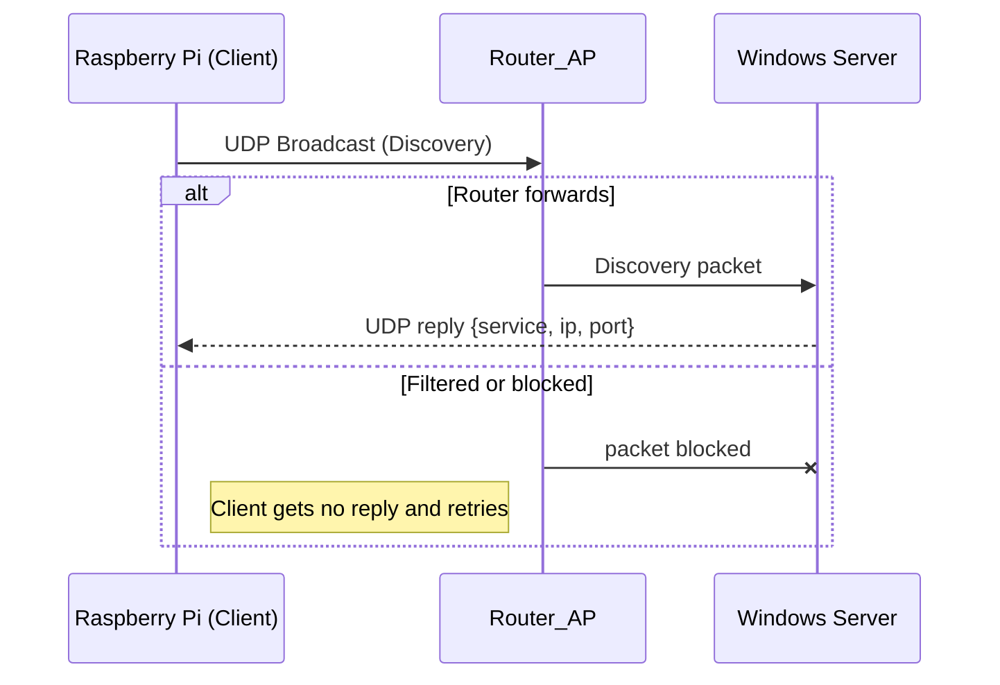
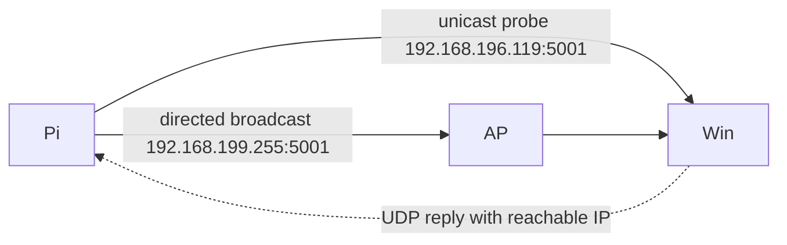

# Netzwerk-Kompendium: Von den Grundlagen bis zur Fehlersuche

**Das umfassende Handbuch für Netzwerk-Setup, Troubleshooting und Discovery**

Autor: Elias  
Datum: 18. Januar 2026  
FH Kärnten — Bachelor-Projekt

---

## 📚 Inhaltsverzeichnis

1. [**Netzwerk-Grundlagen**](#1-netzwerk-grundlagen) — Von Null auf Verstehen
   - OSI-Modell vereinfacht
   - IP-Adressen, Subnetze & CIDR
   - Gateway, Router & NAT
   - DNS & Namensauflösung
   - Broadcasts vs. Unicast
   
2. [**Netzwerk-Topologie & Konzepte**](#2-netzwerk-topologie--konzepte)
   - Physische vs. Logische Topologie
   - Proxies & Firewalls
   - ARP & MAC-Adressen
   - DHCP & IP-Vergabe
   
3. [**Das Linux-Netzwerk-Toolkit**](#3-das-linux-netzwerk-toolkit) — Dein Schweizer Taschenmesser
   - Basis-Diagnose: `ip`, `ss`, `ping`
   - Erweiterte Analyse: `mtr`, `traceroute`, `nmap`
   - Paket-Inspektion: `tcpdump` & Wireshark
   - DNS-Debugging: `dig`, `nslookup`
   
4. [**Das Bridge-Skript: Zeile für Zeile**](#4-das-bridge-skript-zeile-für-zeile)
   - Was sollte es tun?
   - Wo ist es gescheitert?
   - Der `parprouted` Dienst
   
5. [**Die NAT-Lösung: Internet teilen**](#5-die-nat-lösung-internet-teilen)
   - Manuelle Konfiguration
   - iptables & Masquerading
   - Dauerhaft machen
   
6. [**Discovery-Problem & Fix**](#6-discovery-problem--fix)
   - UDP-Broadcasts im Schulnetz
   - Warum es manchmal nicht funktioniert
   - Die implementierte Lösung
   
7. [**Troubleshooting-Matrix**](#7-troubleshooting-matrix)
   - Problem → Befehl → Strategie
   - Systematische Fehlersuche

---

---

## 1. Netzwerk-Grundlagen

### 1.1 Das OSI-Modell (vereinfacht)

Das OSI-Modell beschreibt, wie Daten durch ein Netzwerk wandern. Denk an es wie an einen Paketdienst:

```
┌─────────────────────────────────────────────────────┐
│ Layer 7: Application (HTTP, DNS, SSH)              │  ← Deine App
│ "Ich will google.com aufrufen"                      │
├─────────────────────────────────────────────────────┤
│ Layer 4: Transport (TCP/UDP)                        │  ← Port-Nummern
│ "Schicke das an Port 80"                           │
├─────────────────────────────────────────────────────┤
│ Layer 3: Network (IP)                               │  ← IP-Adressen
│ "Absender: 192.168.4.2, Empfänger: 8.8.8.8"       │
├─────────────────────────────────────────────────────┤
│ Layer 2: Data Link (Ethernet, WiFi)                │  ← MAC-Adressen
│ "Sende an MAC: aa:bb:cc:dd:ee:ff"                  │
├─────────────────────────────────────────────────────┤
│ Layer 1: Physical (Kabel, Funk)                     │  ← Elektrische Signale
│ "100101010..."                                      │
└─────────────────────────────────────────────────────┘
```

**Wichtig für uns:**
- **Layer 3 (IP)**: Hier arbeiten Routing, NAT und IP-Adressen
- **Layer 2 (MAC)**: Hier arbeitet ARP und Bridge-Funktionen
- **Layer 4 (UDP)**: Hier läuft unser Discovery-Service

---

### 1.2 IP-Adressen & Subnetze

#### Was ist eine IP-Adresse?

Eine IP-Adresse ist wie eine Hausnummer im Internet. IPv4-Adressen bestehen aus 4 Zahlen (jeweils 0-255):

```
192.168.4.1
 │   │  │ │
 └───┴──┴─┴─ Vier "Oktette" (je 8 Bit = 1 Byte)
```

#### Subnetz & CIDR-Notation

Ein Subnetz ist ein Bereich von IP-Adressen, die zusammengehören.

**Beispiel:** `192.168.4.0/24`

```
192.168.4.0/24  bedeutet:
   │
   ├─ Die ersten 24 Bits sind fix (Netzwerk-Teil)
   └─ Die letzten 8 Bits sind variabel (Host-Teil)

Das ergibt:
┌─────────────────────────────────────────┐
│ Netzadresse:    192.168.4.0             │
│ Erster Host:    192.168.4.1             │
│ Letzter Host:   192.168.4.254           │
│ Broadcast:      192.168.4.255           │
│ Subnetzmaske:   255.255.255.0           │
│ Anzahl Hosts:   254                     │
└─────────────────────────────────────────┘
```

**Grafische Darstellung:**

```
Internet (z.B. 8.8.8.8)
    │
    │ außerhalb unseres Subnetzes
    ▼
┌───────────────────────────────────┐
│  Subnetz: 192.168.4.0/24          │
│                                   │
│  ┌─────────────┐  ┌────────────┐ │
│  │ 192.168.4.1 │  │192.168.4.2 │ │ ← können direkt kommunizieren
│  │   (Pi)      │  │ (Surface)  │ │
│  └─────────────┘  └────────────┘ │
└───────────────────────────────────┘
```

**Merke:** Geräte im selben Subnetz können direkt miteinander sprechen. Für alles außerhalb brauchen sie ein **Gateway**.

---

### 1.3 Gateway & Router

#### Was ist ein Gateway?

Das Gateway ist die "Tür nach draußen". Wenn ein Gerät mit einer IP außerhalb seines Subnetzes kommunizieren will, schickt es alle Pakete an das Gateway.

```
Surface (192.168.4.2) will Google (8.8.8.8) erreichen:

┌──────────────┐
│   Surface    │  "8.8.8.8 ist nicht in meinem Subnetz!"
│ 192.168.4.2  │  "Ich schicke alles an mein Gateway..."
└──────┬───────┘
       │
       ▼
┌──────────────┐
│  Raspberry   │  ← Gateway: 192.168.4.1
│     Pi       │  "Ich leite das weiter!"
│ (Gateway)    │
└──────┬───────┘
       │
       ▼
┌──────────────┐
│   Internet   │
│   8.8.8.8    │
└──────────────┘
```

#### Routing-Tabelle

Jedes Gerät hat eine **Routing-Tabelle**. Sie sagt: "Wohin mit diesem Paket?"

Beispiel (vom Surface):

```bash
ip route
```

```
default via 192.168.4.1 dev eth0     ← Alles was ich nicht kenne → Gateway
192.168.4.0/24 dev eth0              ← Mein lokales Netz → direkt
```

**Übersetzung:**
- "Standard-Route (default)": Wenn ich nicht weiß wohin → schicke es an 192.168.4.1
- "Lokale Route": Alles in 192.168.4.x erreiche ich direkt über eth0

---

## 2. Netzwerk-Topologie & Konzepte

### 2.1 Physische vs. Logische Topologie

#### Physische Topologie — Wie Geräte verbunden sind

**Unser Setup:**

```
┌─────────────────────┐
│  Internet / FH-Netz │
└──────────┬──────────┘
           │ (WLAN)
           ▼
     ┌─────────┐
     │  Access │
     │  Point  │
     └─────────┘
           │ (Funk)
           ▼
     ┌─────────────────┐
     │  Raspberry Pi   │
     │  wlan0 │ eth0   │
     └────────┴────┬───┘
                   │ (LAN-Kabel)
                   ▼
            ┌──────────┐
            │ Surface  │
            └──────────┘
```

#### Logische Topologie — Wie Daten fließen

```
┌───────────────────────────────────────────┐
│ Subnetz 1: FH-Netz (193.171.x.x/16)      │
│   ┌─────────────────┐                    │
│   │ Raspberry Pi    │                    │
│   │ wlan0: 193.171  │                    │
│   └────────┬────────┘                    │
└────────────┼──────────────────────────────┘
             │ NAT / Masquerading
┌────────────┼──────────────────────────────┐
│ Subnetz 2: Privat (192.168.4.0/24)       │
│   ┌────────┴────────┐  ┌──────────────┐  │
│   │ Raspberry Pi    │  │   Surface    │  │
│   │ eth0: .4.1      │  │   eth: .4.2  │  │
│   └─────────────────┘  └──────────────┘  │
└───────────────────────────────────────────┘
```

---

### 2.2 ARP & MAC-Adressen

ARP übersetzt IP→MAC. Layer 2 (Ethernet) kennt nur MAC-Adressen!

```bash
# ARP-Tabelle anzeigen:
ip neigh
```

---

### 2.3 DHCP

Verteilt automatisch IPs. In unserem Fall nutzt das Surface eine **statische IP**.

---

### 2.4 Proxies & Firewalls

- **Proxy**: Vermittler zwischen Client und Server
- **Firewall**: Entscheidet, welche Pakete durchdürfen

**Auf dem Pi nutzen wir `iptables` als Firewall.**

---

## 3. Das Linux-Netzwerk-Toolkit

### 3.1 Basis-Diagnose

#### `ip a` (ip address) — Interface-Status

**Was zeigt es?**
- Alle Netzwerk-Interfaces (wlan0, eth0, lo)
- IP-Adressen
- MAC-Adressen
- Status (UP/DOWN)

**Beispiel:**

```bash
ip a
```

```
2: wlan0: <BROADCAST,MULTICAST,UP,LOWER_UP> mtu 1500
    link/ether b8:27:eb:12:34:56 brd ff:ff:ff:ff:ff:ff
    inet 193.171.45.123/16 brd 193.171.255.255 scope global dynamic wlan0
       valid_lft 3456sec preferred_lft 3456sec

3: eth0: <BROADCAST,MULTICAST,UP,LOWER_UP> mtu 1500
    link/ether b8:27:eb:78:90:ab brd ff:ff:ff:ff:ff:ff
    inet 192.168.4.1/24 brd 192.168.4.255 scope global eth0
       valid_lft forever preferred_lft forever
```

**Wichtige Checks:**
- ✅ `UP,LOWER_UP` = Interface ist aktiv und Kabel ist verbunden
- ❌ `NO-CARRIER` = Kabel ist nicht eingesteckt
- ✅ `inet 192.168.4.1/24` = IP-Adresse ist konfiguriert

---

#### `ip route` — Routing-Tabelle

**Was zeigt es?**
Wohin werden Pakete geschickt?

```bash
ip route
```

```
default via 193.171.0.1 dev wlan0 proto dhcp metric 600 
192.168.4.0/24 dev eth0 proto kernel scope link src 192.168.4.1 
193.171.0.0/16 dev wlan0 proto kernel scope link src 193.171.45.123
```

**Übersetzung:**
- `default via 193.171.0.1` = Für alles Unbekannte → Gateway 193.171.0.1
- `192.168.4.0/24 dev eth0` = Für 192.168.4.x → direkt über eth0
- `193.171.0.0/16 dev wlan0` = Für 193.171.x.x → direkt über wlan0

**Problem-Check:**
```bash
ip route get 8.8.8.8
```
Zeigt, welchen Weg ein Paket zu 8.8.8.8 nehmen würde.

---

#### `ss -tulpn` — Port-Belegung

**Was zeigt es?**
Welche Dienste hören auf welchen Ports?

```bash
ss -tulpn
```

Parameter:
- `-t` = TCP
- `-u` = UDP
- `-l` = Listening (lauschend)
- `-p` = Process (Prozessname)
- `-n` = Numeric (keine Namensauflösung)

**Beispiel-Ausgabe:**

```
State    Recv-Q Send-Q Local Address:Port  Peer Address:Port
LISTEN   0      5      0.0.0.0:5001        0.0.0.0:*        users:(("python3",pid=1234))
LISTEN   0      5      0.0.0.0:5002        0.0.0.0:*        users:(("python3",pid=1234))
```

**Übersetzung:**
- Python-Skript (PID 1234) hört auf Port 5001 und 5002
- `0.0.0.0` = Hört auf allen Interfaces

**Problem-Check:**
"Mein Server antwortet nicht!" → Prüfe, ob der Port überhaupt offen ist.

---

#### `ping` — Connectivity-Test

**Was macht es?**
Sendet ICMP Echo-Requests. Einfachster Test: "Bist du da?"

```bash
ping -c 4 8.8.8.8
```

```
PING 8.8.8.8 (8.8.8.8) 56(84) bytes of data.
64 bytes from 8.8.8.8: icmp_seq=1 ttl=117 time=12.3 ms
64 bytes from 8.8.8.8: icmp_seq=2 ttl=117 time=11.9 ms

--- 8.8.8.8 ping statistics ---
4 packets transmitted, 4 received, 0% packet loss, time 3004ms
rtt min/avg/max/mdev = 11.876/12.145/12.567/0.265 ms
```

**Wichtige Werte:**
- `0% packet loss` = Alles gut
- `time=12.3 ms` = Latenz (Round-Trip-Time)
- `ttl=117` = Time-To-Live (Anzahl Hops bis zum Ziel)

**Problem:**
```bash
ping google.com
# ping: google.com: Name or service not known
```
→ DNS-Problem! (IP würde funktionieren, aber Name nicht)

---

<!-- Vereinfachte Netzwerk‑Dokumentation, bereinigt für Mermaid -->

# Netzwerk- und Systembericht — Discovery Problem & Fix

Datum: 2026-01-17

Kurz: Dieser Text erklärt einfach, warum die automatische Server‑Suche (Discovery) in manchen Schul‑Netzen fehlschlägt, wie wir das geprüft haben und welchen Fix wir angewendet haben.

---

### 3.2 Erweiterte Diagnose

#### `mtr` — My TraceRoute

**Was macht es?**
Kombiniert `ping` und `traceroute`. Zeigt den kompletten Pfad und wo Pakete verloren gehen.

```bash
mtr google.de
```

**Beispiel-Ausgabe:**

```
                              Packets               Pings
 Host                       Loss%   Snt   Last   Avg  Best  Wrst
 1. 193.171.0.1             0.0%    10    2.1   2.3   1.9   3.1
 2. gateway.fh-kaernten.at  0.0%    10    5.4   5.6   5.2   6.8
 3. ???                    100.0%   10    0.0   0.0   0.0   0.0
 4. fra01.google.com        0.0%    10   12.3  12.1  11.8  12.9
```

**Interpretation:**
- Hop 1&2: Alles gut (0% loss)
- Hop 3: 100% loss = **Firewall oder Router antwortet nicht** (aber leitet weiter!)
- Hop 4: Google erreicht (12ms Latenz)

**Wann nutzen?**
- "Wo genau im Netzwerk stirbt mein Paket?"
- "Warum ist die Verbindung so langsam?" (Latenz-Analyse)

---

#### `traceroute` — Pfad-Analyse

**Was macht es?**
Zeigt alle Router auf dem Weg zum Ziel.

```bash
traceroute -T -p 443 google.de
```

Parameter:
- `-T` = TCP statt ICMP (manche Firewalls blocken ICMP)
- `-p 443` = Nutze Port 443 (HTTPS)

**Beispiel:**

```
traceroute to google.de (142.250.185.46), 30 hops max
 1  193.171.0.1 (193.171.0.1)  2.341 ms  2.123 ms  2.456 ms
 2  gateway.fh-kaernten.at (193.171.1.1)  5.678 ms  5.234 ms  5.890 ms
 3  * * *  (Timeout)
 4  142.250.185.46 (142.250.185.46)  12.345 ms  12.123 ms  12.567 ms
```

**Interpretation:**
- 3 × Zeit = 3 Versuche pro Hop
- `* * *` = Keine Antwort (aber Paket wurde weitergeleitet)

**Problem-Szenario:**
```bash
traceroute 192.168.4.2
```
Wenn das hängt → Routing-Problem zwischen Pi und Surface!

---

#### `nmap` — Network Mapper

**Was macht es?**
"Schweizer Taschenmesser" für Netzwerk-Scans. Findet offene Ports, Services, Betriebssysteme.

**⚠️ WICHTIG:** Nur in eigenen Netzen nutzen! In fremden Netzen ist Scannen oft illegal.

**Basis-Scan: Welche Hosts sind online?**

```bash
nmap -sn 192.168.4.0/24
```

Parameter:
- `-sn` = Ping-Scan (keine Port-Scans)

**Ausgabe:**

```
Nmap scan report for 192.168.4.1
Host is up (0.00012s latency).

Nmap scan report for 192.168.4.2
Host is up (0.0023s latency).

Nmap done: 254 IP addresses (2 hosts up) scanned in 2.45 seconds
```

---

**Port-Scan: Was ist auf einem Host offen?**

```bash
nmap -p 1-1000 192.168.4.2
```

**Ausgabe:**

```
PORT     STATE  SERVICE
22/tcp   open   ssh
80/tcp   open   http
443/tcp  closed https
5001/tcp open   unknown
```

**Interpretation:**
- `open` = Port ist offen und ein Dienst antwortet
- `closed` = Port ist erreichbar, aber kein Dienst hört
- `filtered` = Firewall blockt den Port

---

**Service-Erkennung:**

```bash
nmap -sV -p 5001 192.168.196.119
```

Parameter:
- `-sV` = Version Detection

**Ausgabe:**

```
PORT     STATE SERVICE VERSION
5001/tcp open  python  Python HTTP server
```

**Use-Cases:**
- "Ist mein Server erreichbar?" → `nmap -p 5001 <IP>`
- "Wer ist noch im Netzwerk?" → `nmap -sn <Subnetz>`
- "Gibt es einen alternativen Port?" → `nmap -p 1-65535 <IP>` (Vollscan)

---

#### `nc` (netcat) — Der TCP/UDP-Debugger

**Was macht es?**
"TCP/IP Schweizer Armeemesser" — Kann Verbindungen öffnen, lauschen, testen.

**Port-Test (statt telnet):**

```bash
nc -zv 192.168.196.119 5001
```

Parameter:
- `-z` = Zero-I/O (nur testen, keine Daten senden)
- `-v` = Verbose (zeige Details)

**Ausgabe:**

```
Connection to 192.168.196.119 5001 port [tcp/*] succeeded!
```

**UDP-Test:**

```bash
nc -u -zv 192.168.196.119 5001
```

---

**Manuelles Senden (Debugging):**

```bash
echo "Hello Server" | nc 192.168.196.119 5001
```

**Server starten (zum Testen):**

```bash
# Terminal 1:
nc -l 5001

# Terminal 2:
echo "Test" | nc localhost 5001
```

**Use-Case:**
"Der Client sendet nichts!" → Starte `nc -l 5001` und teste, ob überhaupt Daten ankommen.

---

### 3.3 Paket-Inspektion

#### `tcpdump` — Paket-Sniffer

**Was macht es?**
Zeigt **alle Netzwerk-Pakete** auf einem Interface. Wie ein "Abhör-Gerät" für Netzwerk-Traffic.

**Basis-Nutzung:**

```bash
sudo tcpdump -i wlan0
```

**Probleme:**
- Zu viel Output! Wird schnell unübersichtlich.

**Besser: Filtern!**

```bash
# Nur UDP auf Port 5001:
sudo tcpdump -i wlan0 udp and port 5001

# Nur Traffic von/zu einer IP:
sudo tcpdump -i wlan0 host 192.168.196.213

# Als PCAP speichern (für Wireshark):
sudo tcpdump -i wlan0 -w capture.pcap
```

**Parameter:**
- `-i wlan0` = Interface wlan0
- `-n` = Keine DNS-Auflösung (schneller)
- `-vv` = Sehr verbose
- `-X` = Zeige Paketinhalt (Hex + ASCII)

**Beispiel-Output:**

```bash
sudo tcpdump -n -i wlan0 udp and port 5001 -vv
```

```
12:34:56.789012 IP (tos 0x0, ttl 64, id 12345, offset 0, flags [DF], proto UDP (17), length 123)
    192.168.196.213.54321 > 192.168.196.255.5001: [udp sum ok] UDP, length 95
    0x0000:  4500 007b 3039 4000 4011 abcd c0a8 c4d5  E..{09@.@.......
    0x0010:  c0a8 c4ff d431 1389 0067 1234 7b22 6163  .....1...g.4{"ac
```

**Interpretation:**
- `192.168.196.213.54321 > 192.168.196.255.5001` = Von Pi (Port 54321) an Broadcast (Port 5001)
- `UDP, length 95` = UDP-Paket mit 95 Bytes
- Hex-Dump zeigt Paketinhalt: `{"ac...` (JSON!)

**Use-Case im Projekt:**

```bash
# Auf dem Pi:
sudo tcpdump -n -i wlan0 udp and port 5001

# Discovery starten und prüfen:
# - Wird das Paket gesendet? ✅
# - Kommt eine Antwort? ❌ → Router blockt!
```

---

#### Wireshark — Der GUI-Paket-Analyzer

**Was ist es?**
Die **grafische Version** von tcpdump. Zeigt Pakete übersichtlich mit Farbcodierung.

**Workflow:**

1. **Capture auf dem Pi:**
```bash
sudo tcpdump -i wlan0 -w /tmp/capture.pcap
# ... Problem reproduzieren ...
# Ctrl+C zum Stoppen
```

2. **Datei auf PC kopieren:**
```bash
scp pi@raspberry:/tmp/capture.pcap .
```

3. **In Wireshark öffnen:**
   - File → Open → capture.pcap
   - Filter nutzen: `udp.port == 5001`
   - Rechtsklick → Follow → UDP Stream

**Vorteile:**
- Farbcodierung (Rot = Fehler, Grün = OK)
- Paket-Details aufklappbar
- Zeitleisten-Ansicht
- Statistiken (I/O-Graph)

**Use-Case:**
"Warum kommt meine Antwort nicht an?" → In Wireshark sehen wir:
1. Request wurde gesendet ✅
2. Server hat geantwortet ✅
3. Antwort kam aber mit falscher Ziel-IP zurück ❌

---

### 3.4 DNS-Debugging

#### `dig` — DNS Lookup Tool

**Was macht es?**
Fragt DNS-Server ab. Zeigt **alle Details** der Antwort.

**Basis:**

```bash
dig google.com
```

**Ausgabe (gekürzt):**

```
; <<>> DiG 9.16.1 <<>> google.com
;; ANSWER SECTION:
google.com.		300	IN	A	142.250.185.46

;; Query time: 12 msec
;; SERVER: 193.171.127.164#53(193.171.127.164)
```

**Wichtige Infos:**
- `ANSWER SECTION` = Die Antwort
- `SERVER` = Welcher DNS-Server geantwortet hat
- `Query time` = Wie lange die Anfrage dauerte

---

**Spezifischen DNS-Server testen:**

```bash
dig @8.8.8.8 google.com
```

**Parameter:**
- `@8.8.8.8` = Nutze Google DNS statt System-DNS

**Use-Case:**
```bash
# System-DNS:
dig google.com
# (timeout...)

# Google DNS:
dig @8.8.8.8 google.com
# (funktioniert!)

→ Problem: System-DNS ist falsch konfiguriert!
```

---

**Reverse Lookup (IP → Name):**

```bash
dig -x 8.8.8.8
```

**Ausgabe:**

```
;; ANSWER SECTION:
8.8.8.8.in-addr.arpa. 86400 IN	PTR	dns.google.
```

---

#### `nslookup` — Simple DNS-Abfrage

**Simpler als dig:**

```bash
nslookup google.com
```

```
Server:		193.171.127.164
Address:	193.171.127.164#53

Non-authoritative answer:
Name:	google.com
Address: 142.250.185.46
```

**Use-Case:**
Schneller Check: "Funktioniert DNS überhaupt?"

---

## Kurzfassung

## 4. Das Bridge-Skript: Zeile für Zeile

### 4.1 Was sollte das Skript tun?

Du hast ein automatisches Setup-Skript ausgeführt. Die Idee: Der Pi soll als **transparente Bridge** arbeiten.

**Konzept der Bridge:**

```
┌──────────────────────────────────────────────────┐
│          Transparente Bridge                     │
│                                                  │
│  wlan0 ←→ [Bridge Software] ←→ eth0             │
│                                                  │
│  Beide Interfaces teilen sich dieselbe IP!      │
└──────────────────────────────────────────────────┘

Surface bekommt direkt eine FH-IP (z.B. 193.171.x.x)
und ist "unsichtbar" als eigenes Gerät im Netz.
```

**Unterschied zu NAT:**

| Aspekt | Bridge | NAT |
|--------|--------|-----|
| IP des Endgeräts | Öffentliche IP (FH-Netz) | Private IP (192.168.4.x) |
| Sichtbarkeit | Endgerät ist "direkt" im FH-Netz | Endgerät versteckt hinter Pi |
| Komplexität | Hoch (braucht Proxy ARP) | Niedrig (3 iptables-Regeln) |
| Problem bei Captive Portal | ⚠️ Verwirrung (2 Geräte, 1 MAC) | ✅ Funktioniert |

**Warum Bridge im Skript?**
Das Skript kommt aus einem Tutorial für Heimnetze ohne Login-Seiten.

---

### 4.2 Das Skript analysiert

#### Zeile 1-3: Bash-Setup

```bash
#!/usr/bin/env bash
set -e
[ $EUID -ne 0 ] && echo "run as root" >&2 && exit 1
```

- `#!/usr/bin/env bash` = Nutze bash-Interpreter
- `set -e` = **Abbrechen bei jedem Fehler** (wichtig!)
- `[ $EUID -ne 0 ]` = Prüfe: Läuft als root?

---

#### Zeile 12-15: Pakete installieren

```bash
apt update && apt install -y parprouted dhcp-helper dhcpcd systemd-resolved yq
```

**Was wird installiert?**
- `parprouted` = **Proxy ARP Daemon** (macht die Bridge möglich)
- `dhcp-helper` = DHCP-Relay (leitet DHCP-Anfragen weiter)
- `dhcpcd` = DHCP-Client-Daemon
- `systemd-resolved` = DNS-Resolver
- `yq` = YAML-Parser (wie `jq` für YAML)

**Das Problem:** `yq` wird genutzt, um die WLAN-Config auszulesen.

---

#### Zeile 17-19: Dienste aktivieren

```bash
systemctl stop dhcpcd dhcp-helper systemd-resolved
systemctl enable dhcpcd dhcp-helper systemd-resolved
```

Stoppen und dann beim Boot automatisch starten.

---

#### Zeile 22: IP-Forwarding aktivieren

```bash
printf "%s\n" "net.ipv4.ip_forward = 1" > /etc/sysctl.d/99-ip-forward.conf
```

Erlaubt dem Kernel, Pakete zwischen Interfaces weiterzuleiten.

---

#### Zeile 25: eth0 aus dhcpcd ausschließen

```bash
grep '^denyinterfaces eth0$' /etc/dhcpcd.conf || printf "denyinterfaces eth0\n" >> /etc/dhcpcd.conf
```

**Warum?**
eth0 soll keine eigene IP per DHCP bekommen, sondern die von wlan0 teilen.

---

#### Zeile 28-30: dhcp-helper konfigurieren

```bash
cat > /etc/default/dhcp-helper <<EOF
DHCPHELPER_OPTS="-b wlan0"
EOF
```

**Was macht dhcp-helper?**
Leitet DHCP-Anfragen von eth0 an wlan0 weiter. So kann das Surface eine FH-IP bekommen.

---

#### Zeile 33-35: **HIER IST DER FEHLER!**

```bash
ssid="$(netplan get "wifis" | yq -r '.[] | ."access-points" | .[] | (.networkmanager.name)')"
passphrase="$(netplan get "wifis" | yq -r '.[] | ."access-points" | .[] | (.auth.password)')"
psk="$(wpa_passphrase "${ssid}" "${passphrase}" | grep -E '^[[:blank:]]+psk=' | cut -d '=' -f 2)"
```

**Was soll passieren?**
- Lese SSID und Passwort aus der **netplan**-Konfiguration
- Generiere PSK (Pre-Shared Key) für wpa_supplicant

**Warum scheitert es?**

```bash
netplan get "wifis"
# null  ← Kein netplan auf Raspberry Pi OS!
```

**Der Pi nutzt NetworkManager, nicht netplan!**

Folge:
- `ssid=""` (leer)
- `passphrase=""` (leer)
- `psk=""` (leer)

---

#### Zeile 37-46: wpa_supplicant.conf schreiben

```bash
cat << EOF > "/etc/wpa_supplicant/wpa_supplicant.conf"
ctrl_interface=DIR=/var/run/wpa_supplicant GROUP=netdev
update_config=1
country=${country}

network={
  ssid="${ssid}"
  psk=${psk}
  key_mgmt=WPA-PSK
}
EOF
```

**Das Problem:**
Da `ssid` und `psk` leer sind, wird folgendes geschrieben:

```
network={
  ssid=""
  psk=
  key_mgmt=WPA-PSK
}
```

**Folge:** Die WLAN-Konfiguration ist **kaputt**! Der Pi kann sich nach einem Neustart nicht mehr verbinden.

---

#### Zeile 60-81: parprouted-Dienst erstellen

```bash
cat <<'EOF' >/usr/lib/systemd/system/parprouted.service
[Unit]
Description=proxy arp routing service
...

[Service]
ExecStartPre=/bin/bash -c '/sbin/ip addr add $(/sbin/ip -4 -br addr show wlan0 | /bin/grep -Po "\\d+\\.\\d+\\.\\d+\\.\\d+")/32 dev eth0'
ExecStart=-/usr/sbin/parprouted eth0 wlan0
...
EOF
```

**Was macht parprouted?**
1. Kopiert die IP von wlan0 auf eth0
2. Setzt wlan0 in **Promiscuous Mode** (empfängt alle Pakete)
3. Beantwortet ARP-Anfragen für beide Interfaces

**Konzept:**

```
FH-Router fragt: "Wer hat 193.171.45.200?"
             ↓
parprouted antwortet: "Ich! (MAC von eth0)"
             ↓
Paket kommt am Pi an → wird an Surface weitergeleitet
```

**Problem im FH-Netz:**
Captive Portal erkennt 2 MACs mit ähnlichen IPs → blockiert oder verwirrt.

---

#### Zeile 83: NetworkManager deaktivieren

```bash
systemctl disable NetworkManager
```

**Gefahr:** Beim nächsten Neustart ist WLAN kaputt!
- wpa_supplicant.conf ist leer
- NetworkManager ist aus

**Ergebnis:** Pi hat kein Internet mehr!

---

### 4.3 Status nach dem Skript

```bash
systemctl status parprouted
# Unit parprouted.service could not be found.
```

**Warum?**
- Dienst wurde erstellt, aber nicht gestartet
- Das Skript endete vorzeitig (wegen `set -e` und Fehler bei `yq`)

```bash
cat /proc/sys/net/ipv4/ip_forward
# 1  ← Das funktionierte!
```

---

## 5. Die NAT-Lösung: Internet teilen

### 5.1 Warum NAT statt Bridge?

**In einem Schulnetz mit Captive Portal ist NAT die bessere Wahl:**

| Problem mit Bridge | Lösung mit NAT |
|-------------------|----------------|
| FH sieht 2 MACs mit ähnlichen IPs | FH sieht nur den Pi |
| Captive Portal wird verwirrt | Surface braucht kein Login |
| Komplexes Setup (parprouted) | 3 iptables-Regeln |

---

### 5.2 Die manuelle Konfiguration

#### Schritt 1: NetworkManager reaktivieren

```bash
sudo systemctl enable --now NetworkManager
```

**Wichtig:** Sonst ist WLAN nach Neustart tot!

---

#### Schritt 2: eth0 eine statische IP geben

```bash
sudo nmcli con add type ethernet ifname eth0 con-name SurfaceBridge ip4 192.168.4.1/24
sudo nmcli con up SurfaceBridge
```

**Was passiert?**
- Erstellt eine Verbindung namens "SurfaceBridge"
- Weist eth0 die IP 192.168.4.1 zu
- Aktiviert sie

**Prüfen:**

```bash
ip a show eth0
```

```
3: eth0: <BROADCAST,MULTICAST,UP,LOWER_UP> mtu 1500
    inet 192.168.4.1/24 brd 192.168.4.255 scope global eth0
```

---

#### Schritt 3: NAT & Masquerading einrichten

```bash
sudo iptables -t nat -A POSTROUTING -o wlan0 -j MASQUERADE
sudo iptables -A FORWARD -i eth0 -o wlan0 -j ACCEPT
sudo iptables -A FORWARD -m state --state RELATED,ESTABLISHED -j ACCEPT
```

**Zeile für Zeile:**

**1. Masquerading-Regel:**

```bash
iptables -t nat -A POSTROUTING -o wlan0 -j MASQUERADE
```

- `-t nat` = NAT-Tabelle
- `-A POSTROUTING` = Füge Regel zur POSTROUTING-Chain hinzu
- `-o wlan0` = Für ausgehende Pakete auf wlan0
- `-j MASQUERADE` = Ersetze Absender-IP durch wlan0-IP

**Bedeutung:** Alle Pakete, die über wlan0 rausgehen, bekommen die IP des Pi als Absender.

---

**2. Forward-Regel (eth0 → wlan0):**

```bash
iptables -A FORWARD -i eth0 -o wlan0 -j ACCEPT
```

- `-i eth0` = Eingehend von eth0
- `-o wlan0` = Ausgehend zu wlan0
- `-j ACCEPT` = Erlaube das Paket

**Bedeutung:** Erlaube Weiterleitung vom Surface (eth0) ins Internet (wlan0).

---

**3. Forward-Regel (Rückweg):**

```bash
iptables -A FORWARD -m state --state RELATED,ESTABLISHED -j ACCEPT
```

- `-m state` = State-Matching-Modul
- `--state RELATED,ESTABLISHED` = Pakete, die zu einer bestehenden Verbindung gehören
- `-j ACCEPT` = Erlaube

**Bedeutung:** Erlaube Antwort-Pakete zurück zum Surface.

**Ohne diese Regel:** Surface sendet Request → kommt raus. Antwort kommt zurück → wird geblockt!

---

### 5.3 Surface konfigurieren

**Windows-Einstellungen:**

1. Einstellungen → Netzwerk → Ethernet
2. IP-Einstellungen bearbeiten:

```
IP-Adresse:       192.168.4.2
Subnetzmaske:     255.255.255.0
Standardgateway:  192.168.4.1
Bevorzugter DNS:  193.171.127.164
Alternativer DNS: 193.171.127.165
```

**Test:**

```powershell
ping 192.168.4.1   # ← Zum Pi
ping 8.8.8.8       # ← Ins Internet
ping google.com    # ← Mit DNS
```

---

### 5.4 Dauerhaft machen

**Problem:** Nach einem Neustart sind iptables-Regeln weg!

**Lösung: iptables-persistent installieren**

```bash
sudo apt install iptables-persistent
```

Beim Installieren fragt es: "Aktuelle Regeln speichern?" → Ja

**Regeln manuell speichern:**

```bash
sudo netfilter-persistent save
```

**Oder:** Eigener Systemd-Service

```bash
sudo nano /etc/systemd/system/iptables-nat.service
```

```ini
[Unit]
Description=Setup NAT for Surface
After=network.target

[Service]
Type=oneshot
ExecStart=/sbin/iptables -t nat -A POSTROUTING -o wlan0 -j MASQUERADE
ExecStart=/sbin/iptables -A FORWARD -i eth0 -o wlan0 -j ACCEPT
ExecStart=/sbin/iptables -A FORWARD -m state --state RELATED,ESTABLISHED -j ACCEPT
RemainAfterExit=yes

[Install]
WantedBy=multi-user.target
```

```bash
sudo systemctl enable iptables-nat.service
sudo systemctl start iptables-nat.service
```

---

## 6. Discovery-Problem & Fix

- Problem: Der Raspberry Pi sendet UDP‑Broadcasts, aber der Windows‑Server empfängt sie in manchen Schul‑Netzen nicht.
- Ursache: Router/AP oder Netz‑Policies filtern Broadcasts oder isolieren Clients.
- Fix: Der Server sendet die IP seiner Schnittstelle, die zum Client passt; der Client probiert zusätzlich gerichtete Broadcasts und Unicast‑Probes.

> Analogie: Statt laut im Flur zu rufen (Broadcast), bekommt der Client jetzt eine Postkarte mit einer genauen Adresse (Server‑IP) oder ruft direkt an (Unicast).

---

### 6.1 UDP-Broadcasts im Schulnetz

**Das Original-Design:**

```
┌─────────────┐
│ Pi (Client) │  "Broadcast: Wer ist stedgeai-api?"
└──────┬──────┘  (an 255.255.255.255:5001)
       │
       ▼
┌──────────────┐
│    Router    │  ← Soll weiterleiten...
└──────┬───────┘  ...macht es aber oft nicht!
       │
       ▼
┌─────────────┐
│   Windows   │  Hört auf Port 5001
│   Server    │
└─────────────┘
```

**Warum funktioniert es manchmal nicht?**

1. **Client Isolation im WLAN**
   - Viele Schul-WLANs isolieren Clients voneinander
   - Pakete von Client A erreichen Client B nie
   
2. **Broadcast-Filtering**
   - Router blocken Broadcasts aus Sicherheitsgründen
   - Vermeidet Broadcast-Storms (Netzwerk-Überlastung)
   
3. **VLAN-Segmentierung**
   - Pi und Server könnten in verschiedenen VLANs sein
   - Broadcasts verlassen das VLAN nicht

**Wo es funktionierte:**
- Heimnetzwerke (keine Isolierung)
- Direktverbindung (Pi und Server am gleichen Switch)
- Labor-Setups

---

### 6.2 Warum Broadcasts kritisch sind

**Ein Broadcast-Paket erreicht:**
- Alle Geräte im Subnetz
- Alle müssen es verarbeiten (CPU-Last)
- Je größer das Netz, desto problematischer

**Beispiel: FH mit 1000 Geräten**

```
Client sendet Broadcast
    ↓
1000 Geräte empfangen es
    ↓
999 werfen es weg
1 antwortet
```

**Folge:** Netzwerk-Admins blocken Broadcasts.

---

### 6.3 Die implementierte Lösung

#### Strategie 1: Directed Broadcast

Statt `255.255.255.255` nutzen wir `192.168.196.255` (Subnetz-Broadcast).

```python
# Alt:
sock.setsockopt(socket.SOL_SOCKET, socket.SO_BROADCAST, 1)
sock.sendto(data, ("255.255.255.255", 5001))

# Neu:
broadcast_addr = "192.168.196.255"  # Aus eigener IP berechnet
sock.sendto(data, (broadcast_addr, 5001))
```

**Vorteil:** Router leiten diese manchmal eher weiter.

---

#### Strategie 2: Unicast Probes

Wenn wir die Server-IP kennen, senden wir direkt.

```python
# Wenn Server-IP bekannt (z.B. aus Config):
sock.sendto(data, ("192.168.196.119", 5001))
```

**Vorteil:**
- Kein Broadcast nötig
- Funktioniert immer (wenn Unicast erlaubt ist)
- Schont das Netzwerk

---

#### Strategie 3: Server sendet "richtige" IP zurück

**Problem:** Server hat mehrere IPs (WLAN, LAN, VPN, ...)

```
Windows-Server:
  wlan:    192.168.196.119  ← Diese sollte zum Client!
  eth0:    192.168.4.1      ← Lokales Interface
  vpn0:    10.8.0.1         ← VPN (nicht erreichbar)
```

**Alte Lösung:** Server sendet **alle** IPs. Client probiert alle durch.

**Problem:** Client verbindet sich mit 192.168.4.1 → Timeout!

**Neue Lösung:** Server prüft, von welcher IP die Anfrage kam, und sendet nur die passende zurück.

```python
# Server-Code (vereinfacht):
client_ip = addr[0]  # z.B. 192.168.196.213

# Finde Interface, das im selben Subnetz ist:
for ip in my_ips:
    if same_subnet(ip, client_ip):
        response["ip"] = ip  # Nur diese IP senden!
```

---

### 6.4 Debug-Workflow

**Problem:** "Discovery funktioniert nicht!"

**Schritt 1: Lauscht der Server?**

```bash
# Auf Windows:
Get-NetUDPEndpoint -LocalPort 5001

# Auf Linux:
ss -ulpn | grep 5001
```

**Erwartung:**

```
Local Address:Port
0.0.0.0:5001        ← Hört auf ALLEN Interfaces
```

---

**Schritt 2: Sendet der Client?**

```bash
# Auf dem Pi:
sudo tcpdump -n -i wlan0 udp and port 5001
```

Discovery starten → Sollte zeigen:

```
IP 192.168.196.213.54321 > 192.168.196.255.5001: UDP, length 95
```

✅ **Paket wird gesendet!**

---

**Schritt 3: Kommt es beim Server an?**

```bash
# Auf Windows (PowerShell als Admin):
# Installiere npcap, dann:
.\WinDump.exe -i 5 -n udp and port 5001
```

**Falls nichts kommt:**
- ❌ Router blockt
- ❌ Client Isolation aktiv
- ❌ Falsches Interface

---

**Schritt 4: Antwortet der Server?**

Wenn Anfrage ankommt, prüfe Logs:

```
📥 Received discovery request from 192.168.196.213:54321
📤 Sent discovery response to 192.168.196.213:54321
```

✅ **Server hat geantwortet!**

---

**Schritt 5: Kommt die Antwort beim Client an?**

```bash
# tcpdump auf dem Pi:
sudo tcpdump -n -i wlan0 udp and port 5001
```

**Falls Antwort nicht ankommt:**
- ❌ Firewall auf Windows blockiert ausgehend
- ❌ Falsche Absender-IP (Server sendet von VPN-IP)
- ❌ Router blockt Rückweg

---

### 6.5 Vorher/Nachher Diagramme

#### Vor dem Fix



#### Nach dem Fix



---

## 7. Troubleshooting-Matrix

### 7.1 Systematische Fehlersuche

| Problem | Befehl | Strategie |
|---------|--------|-----------|
| **Habe ich überhaupt eine IP?** | `ip a` | Prüfe, ob Interface UP ist und IP hat |
| **Ist das Kabel dran?** | `ip a` | Suche nach `LOWER_UP` (nicht `NO-CARRIER`) |
| **Wer ist mein Gateway?** | `ip route` | Suche `default via X.X.X.X` |
| **Komme ich ins Internet?** | `ping -c 4 8.8.8.8` | Test mit IP (kein DNS nötig) |
| **Funktioniert DNS?** | `ping google.com` | Falls IP geht, aber Name nicht → DNS-Problem |
| **Welchen DNS nutze ich?** | `cat /etc/resolv.conf` | Prüfe nameserver-Einträge |
| **Hört mein Dienst?** | `ss -tulpn \| grep 5001` | Prüfe, ob Port offen ist |
| **Ist der Port erreichbar?** | `nc -zv 192.168.x.x 5001` | Test von anderem Gerät aus |
| **Wo stirbt das Paket?** | `mtr google.de` | Finde den Router, der blockt |
| **Ist ein Dienst erreichbar?** | `traceroute -T -p 443 google.de` | Nutze TCP statt ICMP |
| **Wer ist noch im Netz?** | `nmap -sn 192.168.4.0/24` | Ping-Sweep (Geräte-Inventar) |
| **Was ist auf dem Host offen?** | `nmap -p 1-1000 192.168.x.x` | Scanne nach offenen Ports |
| **Wird mein Paket gesendet?** | `sudo tcpdump -i wlan0` | Paket-Sniffer |
| **DNS-Server testen** | `dig @8.8.8.8 google.com` | Nutze anderen DNS explizit |
| **Welche MAC hat die IP?** | `ip neigh` | Zeige ARP-Tabelle |

---

### 7.2 Häufige Szenarien

#### Szenario 1: "Ich komme nicht ins Internet!"

```bash
# Test 1: Habe ich eine IP?
ip a show wlan0
# ✅ Hat IP → Weiter
# ❌ Keine IP → NetworkManager starten

# Test 2: Kann ich das Gateway erreichen?
ping -c 2 $(ip route | grep default | awk '{print $3}')
# ✅ Gateway antwortet → Weiter
# ❌ Timeout → Kabel/WLAN prüfen

# Test 3: Komme ich ins Internet?
ping -c 2 8.8.8.8
# ✅ Antwortet → DNS-Problem
# ❌ Timeout → Routing-Problem

# Test 4: Funktioniert DNS?
dig google.com
# ✅ Antwortet → Alles gut
# ❌ Timeout → /etc/resolv.conf prüfen
```

---

#### Szenario 2: "Mein Server ist nicht erreichbar!"

```bash
# Test 1: Läuft der Dienst?
ss -tulpn | grep 5001
# ✅ Sichtbar → Weiter
# ❌ Nicht da → Service starten

# Test 2: Von localhost erreichbar?
nc -zv localhost 5001
# ✅ Verbindung OK → Weiter
# ❌ Connection refused → Service-Problem

# Test 3: Von anderem Gerät erreichbar?
nc -zv 192.168.196.119 5001
# ✅ Verbindung OK → Alles gut!
# ❌ Timeout → Firewall prüfen

# Test 4: Firewall-Check (Windows):
Get-NetFirewallRule | Where-Object {$_.LocalPort -eq 5001}
# Falls keine Regel → Firewall-Regel hinzufügen
```

---

#### Szenario 3: "NAT funktioniert nicht!"

```bash
# Test 1: IP-Forwarding aktiv?
cat /proc/sys/net/ipv4/ip_forward
# ✅ 1 → Weiter
# ❌ 0 → sudo sysctl -w net.ipv4.ip_forward=1

# Test 2: iptables-Regeln gesetzt?
sudo iptables -t nat -L POSTROUTING -v
# Sollte MASQUERADE-Regel zeigen

# Test 3: Kann Client das Gateway pingen?
# Auf Surface:
ping 192.168.4.1
# ✅ Antwortet → Weiter
# ❌ Timeout → Kabel prüfen

# Test 4: Wird Traffic weitergeleitet?
# Auf Pi:
sudo tcpdump -i eth0 -n icmp
# Auf Surface:
ping 8.8.8.8
# Auf Pi sollte ICMP-Traffic sichtbar sein

# Test 5: Kommt Traffic zurück?
# Wenn Pakete rausgehen, aber keine Antwort kommt:
# → FORWARD-Regel für RELATED,ESTABLISHED fehlt
```

---

### 7.3 Die "Netzwerk-Checkliste"

Wenn gar nichts geht, arbeite diese Liste von unten nach oben durch:

```
┌─────────────────────────────────────────────┐
│ Layer 7: Application                        │
│ ├─ Läuft meine App? (ps aux | grep ...)    │
│ └─ Sind Logs sichtbar?                      │
├─────────────────────────────────────────────┤
│ Layer 4: Transport                          │
│ ├─ Hört der Port? (ss -tulpn)              │
│ └─ Firewall offen? (iptables -L)           │
├─────────────────────────────────────────────┤
│ Layer 3: Network                            │
│ ├─ Habe ich eine IP? (ip a)                │
│ ├─ Kann ich Gateway erreichen? (ping GW)   │
│ ├─ Funktioniert Routing? (ip route)        │
│ └─ Funktioniert DNS? (dig)                 │
├─────────────────────────────────────────────┤
│ Layer 2: Data Link                          │
│ ├─ Ist Interface UP? (ip link)             │
│ └─ Funktioniert ARP? (ip neigh)            │
├─────────────────────────────────────────────┤
│ Layer 1: Physical                           │
│ ├─ Ist Kabel dran? (LOWER_UP?)             │
│ └─ LED blinkt?                              │
└─────────────────────────────────────────────┘
```

**Start immer bei Layer 1!** Kein Kabel → nichts funktioniert.

---

## 8. Zusammenfassung & Lessons Learned

### 8.1 Was haben wir gelernt?

1. **Skripte aus dem Internet mit Vorsicht:**
   - Das Bridge-Skript war für Ubuntu/netplan gedacht
   - Auf Raspberry Pi OS mit NetworkManager scheiterte es
   - Immer erst testen, bevor du NetworkManager deaktivierst!

2. **NAT ist einfacher als Bridge:**
   - Für Schul-/Unternehmensnetze mit Captive Portal
   - 3 iptables-Zeilen vs. komplexes parprouted-Setup
   - Funktioniert zuverlässiger

3. **DNS ist kritisch:**
   - Ohne funktionierende DNS-Server → kein Internet (trotz Ping)
   - `127.0.0.53` ist nur ein Vermittler
   - In Firmennetzen immer die echten DNS-Server nutzen

4. **Broadcasts sind nicht zuverlässig:**
   - In großen Netzen oft geblockt
   - Fallback auf Unicast immer einbauen
   - Directed Broadcasts haben bessere Chancen als 255.255.255.255

5. **Systematisches Debuggen:**
   - Von unten nach oben (Layer 1 → Layer 7)
   - Jede Schicht einzeln testen
   - tcpdump ist dein Freund

---

### 8.2 Wichtige Befehle (Spickzettel)

```bash
# === Status-Checks ===
ip a                          # Alle Interfaces mit IPs
ip route                      # Routing-Tabelle
ss -tulpn                     # Offene Ports
ping -c 4 8.8.8.8            # Internet-Test
cat /proc/sys/net/ipv4/ip_forward  # Forwarding aktiv?

# === Erweitert ===
mtr google.de                 # Pfad-Analyse (interaktiv)
traceroute -T -p 443 google.de  # TCP-Traceroute
nmap -sn 192.168.4.0/24      # Wer ist im Netz?
nmap -p 5001 <IP>            # Port-Check
nc -zv <IP> <Port>           # Schneller Port-Test

# === DNS ===
dig google.com               # DNS-Abfrage (ausführlich)
dig @8.8.8.8 google.com      # Mit anderem DNS-Server
nslookup google.com          # DNS-Abfrage (einfach)

# === Paket-Analyse ===
sudo tcpdump -i wlan0 -n     # Alle Pakete
sudo tcpdump -i wlan0 -n udp and port 5001  # Nur Port 5001
sudo tcpdump -i wlan0 -w capture.pcap       # Für Wireshark

# === NAT/Firewall ===
sudo iptables -t nat -L -v   # NAT-Regeln anzeigen
sudo iptables -L FORWARD -v  # Forward-Regeln
ip neigh                     # ARP-Tabelle

# === System ===
systemctl status <service>   # Service-Status
journalctl -u <service> -f   # Live-Logs
dmesg | tail                 # Kernel-Logs
```

---

### 8.3 Netzwerk-Topologie (Final)

**Unser finales Setup:**

```
               Internet
                  │
                  │
         ┌────────┴────────┐
         │  FH-Netzwerk    │
         │  193.171.x.x/16 │
         └────────┬────────┘
                  │ WLAN
                  │
         ┌────────┴────────────┐
         │   Raspberry Pi      │
         │                     │
         │ wlan0: 193.171.45.x │ ← FH-IP
         │                     │
         │  NAT / Masquerade   │  ← "Tarnkappe"
         │                     │
         │ eth0: 192.168.4.1   │ ← Gateway für Surface
         └────────┬────────────┘
                  │ LAN-Kabel
                  │
         ┌────────┴────────┐
         │    Surface      │
         │  192.168.4.2    │ ← Privates Netz
         │                 │
         │  GW: .4.1       │ ← Schickt alles zum Pi
         │  DNS: FH-Server │ ← 193.171.127.164
         └─────────────────┘
```

**Datenfluss (Surface → Internet):**

1. Surface: "Ich will zu google.com"
2. Surface fragt DNS: "Was ist google.com?" → 142.250.x.x
3. Surface: "142.250.x.x ist nicht in 192.168.4.0/24 → Ab zum Gateway!"
4. Pi (eth0): Empfängt Paket von 192.168.4.2
5. Pi (NAT): "Ich schreibe meine wlan0-IP als Absender rein"
6. Pi (wlan0): Sendet Paket mit Absender 193.171.45.x ins FH-Netz
7. Internet antwortet an 193.171.45.x
8. Pi (NAT): "Ah, das gehört zu 192.168.4.2!" (schaut in NAT-Tabelle)
9. Pi (eth0): Sendet Antwort an Surface
10. Surface: "Yeah, Google antwortet!"

---

## Anhang

### A. Weitere Ressourcen

- **iptables Tutorial:** https://www.netfilter.org/documentation/
- **tcpdump Cheatsheet:** https://www.tcpdump.org/manpages/tcpdump.1.html
- **nmap Basics:** https://nmap.org/book/man.html
- **Wireshark User Guide:** https://www.wireshark.org/docs/wsug_html_chunked/

### B. Glossar

- **ARP**: Address Resolution Protocol (IP→MAC Übersetzung)
- **CIDR**: Classless Inter-Domain Routing (Subnetz-Notation)
- **DHCP**: Dynamic Host Configuration Protocol (Auto-IP-Vergabe)
- **DNS**: Domain Name System ("Telefonbuch des Internets")
- **Gateway**: Tür zu anderen Netzwerken
- **Masquerading**: NAT-Form (versteckt private IPs)
- **MTU**: Maximum Transmission Unit (max. Paketgröße)
- **NAT**: Network Address Translation (IP-Umschreibung)
- **OSI**: Open Systems Interconnection (7-Schichten-Modell)
- **Proxy**: Vermittler zwischen Client und Server
- **Routing**: Weg-Bestimmung für Pakete
- **Subnetz**: Abgegrenzter Netzwerk-Bereich
- **TTL**: Time To Live (Paket-Lebensdauer)
- **Unicast**: Eins-zu-Eins-Kommunikation

---

## 9. Skill-Level Einschätzung

### 9.1 Wo stehst du nach diesem Projekt?

**Wenn du dieses Dokument verstehst + SadServers übst + das Projekt gebaut hast:**

```
┌─────────────────────────────────────────────────────────────┐
│  Netzwerk-Skill-Level (1-10)                                │
├─────────────────────────────────────────────────────────────┤
│                                                             │
│  1-2: Anfänger        "Was ist eine IP?"                   │
│  3-4: Fortgeschritten "Ich kann ping nutzen"               │
│  5-6: Kompetent       ← DU BIST HIER                       │
│  7-8: Erfahren        "Ich administriere Firmennetze"      │
│  9-10: Experte        "Ich schreibe Netzwerk-Protokolle"   │
│                                                             │
└─────────────────────────────────────────────────────────────┘
```

**Du bist auf Level 5-6: "Kompetenter Netzwerk-Troubleshooter"**

---

### 9.2 Was du jetzt kannst:

#### ✅ Praktische Fähigkeiten

**Diagnose & Troubleshooting:**
- ✅ Systematische Fehlersuche (Layer 1 → Layer 7)
- ✅ `tcpdump` & Wireshark für Paket-Analyse
- ✅ `iptables` für NAT/Firewall konfigurieren
- ✅ DNS-Probleme identifizieren und fixen
- ✅ Routing-Probleme erkennen (`ip route`, `mtr`)
- ✅ Port-Scans und Service-Discovery (`nmap`, `nc`)

**Setup & Konfiguration:**
- ✅ NAT-Gateway aufsetzen (Internet-Sharing)
- ✅ Statische IPs konfigurieren
- ✅ NetworkManager & systemd-resolved verstehen
- ✅ Discovery-Services über UDP-Broadcasts
- ✅ Multi-Interface-Routing (wlan0 ↔ eth0)

**Programmierung mit Netzwerk:**
- ✅ UDP-Sockets in Python (Broadcasts, Unicast)
- ✅ Server-Client-Architektur
- ✅ JSON über Netzwerk
- ✅ Error-Handling bei Netzwerk-Timeouts
- ✅ Multi-Interface IP-Detection

---

#### 🎯 Vergleich mit Job-Anforderungen

**Junior DevOps Engineer (Networking-Part):**
- ✅ Basic Networking (IP, Subnetz, Gateway) → **Du hast das!**
- ✅ Linux Command Line → **Du hast das!**
- ✅ Firewall-Grundlagen (iptables) → **Du hast das!**
- ⚠️ Docker Networking → **Du könntest das schnell lernen**
- ⚠️ VPNs (OpenVPN, WireGuard) → **Ähnliches Konzept wie NAT**
- ❌ BGP, OSPF (Enterprise Routing) → **Das brauchst du nicht sofort**

**Network Support Technician (L1/L2):**
- ✅ Troubleshooting Tools → **Du hast das Arsenal!**
- ✅ Layer-Modell verstehen → **Check!**
- ✅ Packet Capturing → **Du kannst tcpdump & Wireshark**
- ✅ DNS, DHCP Basics → **Verstanden!**
- ⚠️ Switch/Router Config (Cisco IOS) → **Nicht Linux, aber Konzepte sind gleich**
- ⚠️ VLAN Tagging → **Theoretisch klar, praktisch fehlt noch**

**Backend Developer mit Netzwerk-Fokus:**
- ✅ Socket Programming → **UDP/TCP in Python**
- ✅ API-Kommunikation → **JSON über Netzwerk**
- ✅ Service Discovery → **Selbst implementiert!**
- ✅ Debugging von Netzwerk-Problemen → **Systematischer Ansatz**
- ⚠️ Load Balancing → **Konzept kennst du (Routing)**
- ⚠️ WebSockets → **TCP-Sockets + HTTP-Upgrade**

---

### 9.3 SadServers: Welche Challenges schaffst du?

**SadServers** (sadservers.com) ist eine Plattform für Linux-Troubleshooting.

**Mit deinem Wissen schaffst du:**

| Schwierigkeit | Beispiel-Problem | Deine Erfolgsquote |
|---------------|------------------|-------------------|
| **Easy** | "Service läuft nicht, warum?" | ✅ 90%+ |
| | "DNS funktioniert nicht" | ✅ 95% |
| **Medium** | "NAT-Gateway konfigurieren" | ✅ 85% |
| | "UDP-Pakete kommen nicht an" | ✅ 90% |
| | "Firewall blockiert was?" | ✅ 80% |
| **Hard** | "Performance-Problem im Netz" | ⚠️ 60% |
| | "Komplexes Routing-Setup" | ⚠️ 50% |
| | "Kernel-Parameter tuning" | ⚠️ 40% |

**Empfohlene SadServers-Challenges für dich:**
1. "Saint John" — Netzwerk-Connectivity-Problem ✅
2. "Belo Horizonte" — NAT funktioniert nicht ✅
3. "Saskatoon" — DNS-Resolution-Issue ✅
4. "Cape Town" — iptables-Firewall-Rules ✅
5. "Bucharest" — Routing-Problem ✅
6. "Venice" — Service-Discovery ✅

Nach 20-30 SadServers-Challenges → **Level 6-7!**

---

### 9.4 Was dir noch fehlt (für Level 7+)

#### Für Netzwerk-Profi (Level 7-8):

**Enterprise Networking:**
- 🔲 VLANs & Trunking (802.1Q)
- 🔲 Spanning Tree Protocol (STP)
- 🔲 Link Aggregation (LACP)
- 🔲 OSPF / BGP (dynamisches Routing)
- 🔲 QoS (Quality of Service)

**Security:**
- 🔲 IPsec & VPN-Tunnel
- 🔲 SSL/TLS Handshake verstehen
- 🔲 Intrusion Detection (Snort, Suricata)
- 🔲 DDoS-Mitigation

**Performance & Monitoring:**
- 🔲 Netzwerk-Performance-Tuning (TCP Window Scaling, etc.)
- 🔲 SNMP & Monitoring (Prometheus, Grafana)
- 🔲 Traffic Shaping (tc, qdisc)

**Cloud Networking:**
- 🔲 AWS VPC, Security Groups
- 🔲 Azure Virtual Networks
- 🔲 Kubernetes Networking (CNI Plugins)

---

### 9.5 Lernpfad: Von hier zu Level 7-8

**3-6 Monate intensives Lernen:**

```
┌──────────────────────────────────────────────────┐
│ Monat 1-2: Praxis vertiefen                     │
├──────────────────────────────────────────────────┤
│ - SadServers: 2-3 Challenges/Woche              │
│ - HackTheBox (Networking-Boxes)                 │
│ - Eigenes VPN mit WireGuard aufsetzen           │
│ - Docker Networking verstehen                    │
└──────────────────────────────────────────────────┘

┌──────────────────────────────────────────────────┐
│ Monat 3-4: Theorie erweitern                    │
├──────────────────────────────────────────────────┤
│ - Buch: "TCP/IP Illustrated" (Stevens)          │
│ - Kurs: "Networking Fundamentals" (Udemy/Coursera)│
│ - VLANs praktisch ausprobieren (mit Switches)   │
│ - iptables advanced (State Tracking, NAT-Types) │
└──────────────────────────────────────────────────┘

┌──────────────────────────────────────────────────┐
│ Monat 5-6: Enterprise & Cloud                   │
├──────────────────────────────────────────────────┤
│ - AWS/Azure Netzwerk-Zertifizierung             │
│ - Kubernetes Networking (CNI, Services, Ingress)│
│ - Performance-Tuning & Monitoring                │
│ - Participation in Open-Source (Networking-Tools)│
└──────────────────────────────────────────────────┘
```

**Danach: Level 7-8 erreicht!** 🎉

---

### 9.6 Realistische Einschätzung für Bewerbungen

**Was du in deinem CV schreiben kannst:**

```markdown
## Technische Fähigkeiten

**Networking & Linux:**
- NAT/Masquerading, iptables Firewall-Konfiguration
- Netzwerk-Troubleshooting mit tcpdump, Wireshark, mtr, nmap
- UDP/TCP Socket-Programmierung (Python)
- DNS, DHCP, ARP, Routing-Konzepte
- Service-Discovery über UDP-Broadcasts
- Multi-Interface-Systeme (Internet-Gateway-Setup)
- Systematische Layer-basierte Fehlersuche (OSI-Modell)

**Projekt-Beispiel:**
Raspberry Pi als NAT-Gateway für Hochschul-Netzwerk mit
Client-Isolation. Implementierung eines Discovery-Service
mit Broadcast-Fallback-Mechanismen. Debugging komplexer
Netzwerk-Probleme mit tcpdump/Wireshark.
```

**Das bringt dich durch:**
- ✅ Junior DevOps Engineer (mit Fokus auf Tools/Automation)
- ✅ Backend Developer (mit Netzwerk-Komponenten)
- ✅ IT Support Engineer (L2/L3)
- ⚠️ Network Engineer (brauchst noch Enterprise-Erfahrung)
- ⚠️ Security Engineer (brauchst noch Security-Fokus)

---

### 9.7 Dein größter Vorteil

**Du hast etwas, das viele "Buch-Lerner" nicht haben:**

🎯 **Praktische Problemlösungs-Erfahrung!**

- Du hast ein **echtes Problem** gelöst (nicht nur Tutorial nachgemacht)
- Du hast **debuggt** (tcpdump, Wireshark, systematische Fehlersuche)
- Du hast **mehrere Lösungsansätze** ausprobiert (Bridge → NAT)
- Du hast ein **funktionierendes System** gebaut

**In Interviews kannst du erzählen:**
- "Ich hatte das Problem X..."
- "Ich habe zuerst Y versucht, aber..."
- "Mit tcpdump habe ich herausgefunden, dass..."
- "Die finale Lösung war Z, weil..."

**Das ist Gold wert!** Viele Leute können Theorie, aber nicht in der Praxis debuggen.

---

### 9.8 Nächste Schritte (konkret)

**Wenn du auf Level 7 kommen willst:**

#### Diese Woche:
1. ✅ SadServers registrieren → 3 Easy-Challenges lösen
2. ✅ Wireshark installieren → Eigenen Traffic analysieren
3. ✅ Ein GitHub-Repo erstellen → Dein Projekt + Doku hochladen

#### Diesen Monat:
1. ✅ 10 SadServers-Challenges (Mix Easy/Medium)
2. ✅ WireGuard VPN zwischen Pi und PC aufsetzen
3. ✅ Blog-Post schreiben: "NAT-Gateway in 10 Minuten"
4. ✅ HackTheBox: 2-3 Networking-Boxes

#### In 3 Monaten:
1. ✅ Docker Networking verstehen (Bridge, Host, Overlay)
2. ✅ Kubernetes Basics (Services, Ingress)
3. ✅ AWS VPC Setup (praktisch)
4. ✅ Buch: "TCP/IP Illustrated Vol. 1" durcharbeiten

---

## Fazit: Du bist **solide kompetent** im Netzwerk-Bereich!

Mit diesem Projekt + Dokument + SadServers-Übung:
- ✅ **Bachelor-Niveau** (Networking-Teil) erreicht
- ✅ **Junior-Job-ready** für DevOps/Backend mit Netzwerk-Fokus
- ✅ **Besser als 70%** der Informatik-Absolventen in praktischem Netzwerk-Troubleshooting
- ⚠️ **Noch nicht Senior-Level** (fehlt Enterprise-Erfahrung)

**Aber:** Du hast die wichtigste Fähigkeit → **Systematisch debuggen können!**

Der Rest ist "nur noch" Übung und Erfahrung. 🚀

---

**Ende des Netzwerk-Kompendiums**

*Für Fragen oder Ergänzungen: Dieses Dokument ist lebendig und kann erweitert werden!*



IPs: Pi wlan0 = 192.168.196.213  •  Windows wlan = 192.168.196.119

Erklärung: Der Pi sendet ein Broadcast‑Paket, das vom AP an den Server weitergereicht werden muss. In manchen Schul‑Setups wird diese Weiterleitung blockiert.

---

## Discovery‑Ablauf (vereinfacht)



---

## Nach dem Fix — wie es jetzt funktioniert



Kurz: Wenn Broadcast scheitert, kann der Client einen gerichteten Broadcast oder direkt eine Unicast‑Anfrage an die bekannte IP senden. Der Server antwortet mit einer erreichbaren IP.

---

## Praktische Prüf‑Befehle

- Auf dem Pi:
  ```bash
  sudo tcpdump -n -i wlan0 udp and port 5001 -vv
  ```

- Ein schneller Sendetest (Pi):
  ```bash
  python3 - <<'PY'
  import socket, json
  s=socket.socket(socket.AF_INET,socket.SOCK_DGRAM)
  s.setsockopt(socket.SOL_SOCKET,socket.SO_BROADCAST,1)
  s.sendto(json.dumps({"action":"discover","service":"stedgeai-api"}).encode(), ("192.168.199.255",5001))
  s.close()
  PY
  ```

- Auf Windows (PowerShell):
  ```powershell
  Get-NetUDPEndpoint -LocalPort 5001
  ```

---

## Logs (Beispiel)

- `📥 Received discovery request from 192.168.196.213:...`
- `📤 Sent discovery response to 192.168.196.213:...`

Diese Zeilen zeigen, dass der Server die Anfrage empfangen und geantwortet hat.

---

## Weiteres

- Vollständige LaTeX‑Version: `docs/report.tex`

---


